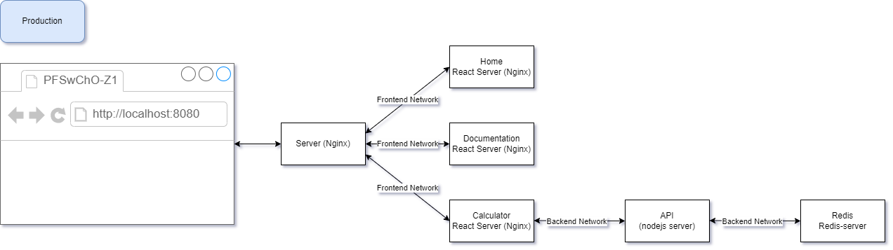
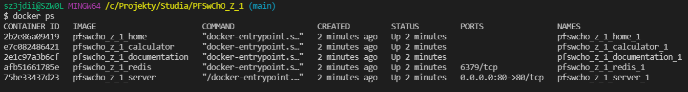
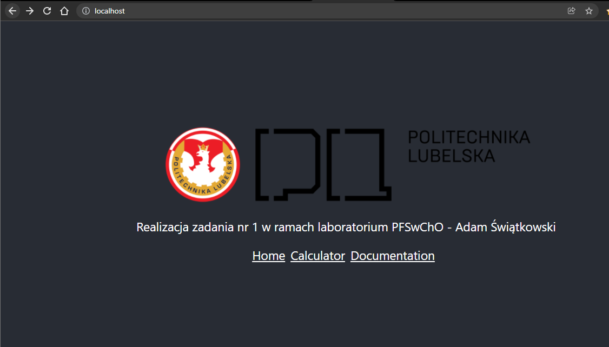
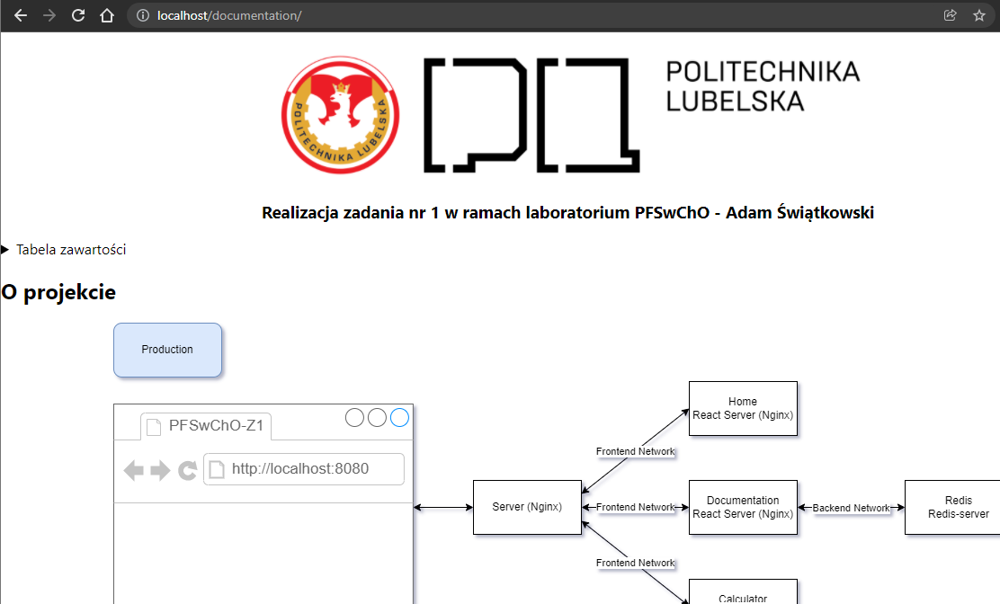

<div id="top"></div>


<!-- PROJECT LOGO -->
<br />
<div align="center">
  <a href="https://github.com/sz3jdii/PFSwChO_Z_1">
    
  </a>

<h3 align="center">Realizacja zadania nr 1 w ramach laboratorium PFSwChO - Adam Świątkowski</h3>

</div>


<!-- TABLE OF CONTENTS -->
<details>
  <summary>Tabela zawartości</summary>
  <ol>
    <li>
      <a href="#about-the-project">O projekcie</a>
      <ul>
        <li><a href="#built-with">Stworzone przy użyciu</a></li>
      </ul>
    </li>
    <li>
      <a href="#getting-started">Uruchamianie</a>
      <ul>
        <li><a href="#prerequisites">Wymagania</a></li>
        <li><a href="#installation">Instalacja - DEV</a></li>
        <li><a href="#installation">Instalacja - PROD</a></li>
        <li><a href="#screenshoots">Zrzuty ekranu</a></li>
      </ul>
    </li>
  </ol>
</details>


<!-- ABOUT THE PROJECT -->
## O projekcie
<div align="center">
    
</div>
Aplikacja została stworzona do działania w środowisku Docker. W środowisku tym, kontener `server` jest głównym routerem ruchu frontendu i rozdziela on ruch na składowe kontenery aplikacji, czyli `documentation`, `home` oraz `calculator`. Analizuje on ruch na podstawie żądania przychodzącego (cząstki po /), a następnie dopasowuję ją do zadeklarowanego serwera upstream.

<p align="right">(<a href="#top">powrót do góry</a>)</p>


### Stworzone przy użyciu

* [Docker](https://www.docker.com/)
* [nodeJS](https://nodejs.org/en/)
* [ReactJS](https://pl.reactjs.org/)

<p align="right">(<a href="#top">powrót do góry</a>)</p>


<!-- GETTING STARTED -->
## Uruchamianie

W celu uruchomienia aplikacji wykonaj poniższe polecenia

### Wymagania

This is an example of how to list things you need to use the software and how to install them.

### Instalacja - DEV

1. Sklonuj repo
   ```sh
   git clone https://github.com/sz3jdii/PFSwChO_Z_1.git
   ```
3. Skopiuj i wypełnij plik .env.example do .env
   ```sh
   cp .env.example .env
   nano .env
   ```
2. Uruchom przy użyciu docker-compose
   ```sh
   docker-compose -f docker-compose.dev.yml up --build --force-recreate
   ```
### Instalacja - PROD

Instalacja na środowisku produkcyjnym odbywa się z wykorzystaniem pipeline'ów oraz TravisCI.

<p align="right">(<a href="#top">powrót do góry</a>)</p>

### Zrzuty ekranu

<div align="center">
    
</div>
<div align="center">
    
</div>
<div align="center">
    
</div>
<p align="right">(<a href="#top">powrót do góry</a>)</p>